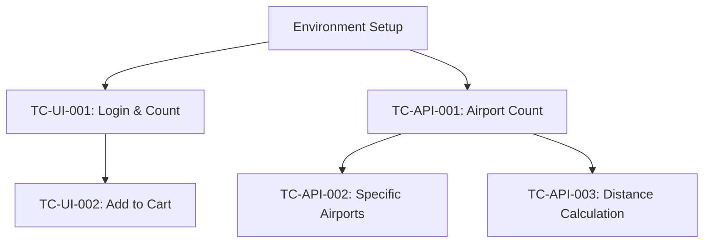

# System Test Plan (STP)

## Test Plan Overview

**Project:** Playwright UI & API Automation Framework  
**Test Plan Version:** 1.0.0  
**Date:** 2024  
**Test Environment:** SauceDemo & AirportGap

## Test Objectives

### Primary Goals
1. Validate UI functionality of SauceDemo e-commerce application
2. Verify API functionality and data integrity of AirportGap service
3. Ensure automated test framework reliability and maintainability
4. Generate comprehensive test reports with Allure integration

### Success Criteria
- All test cases execute successfully in CI/CD pipeline
- Test reports are automatically published to GitHub Pages
- Framework demonstrates robust error handling and recovery
- Code coverage meets quality standards

## Test Scope

### In Scope
- **SauceDemo UI Testing**: Login, inventory, and cart functionality
- **AirportGap API Testing**: Airport data retrieval and distance calculations
- **Framework Testing**: Core functionality and error handling
- **Reporting Testing**: Allure report generation and publication

### Out of Scope
- Performance testing under load
- Security penetration testing
- Mobile browser testing
- Real user data or production systems

## Test Environment Setup

### Prerequisites
```bash
# Install dependencies
make install

# Setup development environment
make setup

# Verify installation
pytest --version
playwright --version
allure --version
```

### Test Data Requirements
- **SauceDemo Users**: Standard test users from testdata/users.yaml
- **Airport Data**: Expected airport information in testdata/api_expected.yaml
- **Test Configuration**: Environment-specific settings in src/config/

## Test Categories and Markers

### Pytest Markers
- `@pytest.mark.ui`: UI tests using browser automation
- `@pytest.mark.api`: API tests using HTTP requests
- `@pytest.mark.smoke`: Critical path tests for quick validation
- `@pytest.mark.regression`: Comprehensive test suite for full validation

### Test Execution Commands
```bash
# Run all tests
make test-all

# Run UI tests only
make test-ui

# Run API tests only  
make test-api

# Run smoke tests
pytest -m smoke

# Run with parallel execution
pytest -n auto
```

## Detailed Test Cases

### UI Test Cases (SauceDemo)

#### TC-UI-001: Inventory List Count Verification
**Objective:** Verify that exactly 6 items are displayed in the inventory after successful login

**Preconditions:**
- SauceDemo application is accessible
- Valid user credentials are available
- Browser is launched and configured

**Test Steps:**
1. Navigate to SauceDemo login page (https://www.saucedemo.com)
2. Enter valid username: "standard_user"
3. Enter valid password: "secret_sauce"
4. Click the "Login" button
5. Wait for inventory page to load completely
6. Count the number of inventory items displayed
7. Verify exactly 6 items are present

**Expected Results:**
- Login is successful and redirects to inventory page
- Inventory page displays exactly 6 product items
- All items have proper product information (name, price, image)

**Test Data:**
```yaml
user:
  username: "standard_user"
  password: "secret_sauce"
expected:
  inventory_count: 6
```

**Automation File:** `tests/ui/test_inventory_list_count.py`

**Cleanup:** Logout or close browser session

---

#### TC-UI-002: Add First Item to Cart Functionality
**Objective:** Verify that adding the first inventory item to cart updates the cart badge to show "1"

**Preconditions:**
- User is logged into SauceDemo application
- Inventory page is loaded with products visible
- Shopping cart is initially empty

**Test Steps:**
1. Navigate to SauceDemo and complete login (reuse from TC-UI-001)
2. Locate the first product item in the inventory
3. Identify the "Add to cart" button for the first item
4. Click the "Add to cart" button
5. Verify button text changes to "Remove"
6. Check the shopping cart badge in the header
7. Verify cart badge displays "1"

**Expected Results:**
- First product is successfully added to cart
- "Add to cart" button changes to "Remove"
- Shopping cart badge appears with count "1"
- Cart icon is highlighted/updated to show active state

**Test Data:**
```yaml
user:
  username: "standard_user"
  password: "secret_sauce"
expected:
  cart_badge_count: "1"
  button_text_after_add: "Remove"
```

**Automation File:** `tests/ui/test_add_first_item_to_cart.py`

**Cleanup:** Remove item from cart or reset cart state

---

### API Test Cases (AirportGap)

#### TC-API-001: Airport Count Verification
**Objective:** Verify that the AirportGap API returns exactly 30 airports in the response

**Preconditions:**
- AirportGap API is accessible at https://airportgap.com
- Network connectivity is available
- API client is configured with proper timeouts

**Test Steps:**
1. Send GET request to `/api/airports`
2. Verify HTTP response status is 200
3. Parse the JSON response body
4. Extract the airports data array
5. Count the number of airport objects
6. Verify exactly 30 airports are returned

**Expected Results:**
- HTTP status code is 200 (OK)
- Response contains valid JSON structure
- "data" array contains exactly 30 airport objects
- Each airport object has required fields (id, type, attributes)

**Test Data:**
```yaml
api:
  endpoint: "/api/airports"
  method: "GET"
expected:
  status_code: 200
  airports_count: 30
```

**Automation File:** `tests/api/test_airports_count.py`

**Cleanup:** No cleanup required for read-only operation

---

#### TC-API-002: Specific Airports Presence Verification
**Objective:** Verify that specific airports (Akureyri, St. Anthony, CFB Bagotville) are present in the API response

**Preconditions:**
- AirportGap API is accessible
- TC-API-001 has verified basic API functionality
- Airport names are correctly configured in test data

**Test Steps:**
1. Send GET request to `/api/airports`
2. Verify HTTP response status is 200
3. Parse the JSON response and extract airport data
4. Create a list of all airport names from the response
5. Verify "Akureyri" airport is present in the list
6. Verify "St. Anthony" airport is present in the list
7. Verify "CFB Bagotville" airport is present in the list

**Expected Results:**
- All three specified airports are found in the response
- Airport names match exactly (case-sensitive)
- Each airport has complete attribute information

**Test Data:**
```yaml
api:
  endpoint: "/api/airports"
  method: "GET"
expected:
  required_airports:
    - "Akureyri"
    - "St. Anthony"
    - "CFB Bagotville"
```

**Automation File:** `tests/api/test_airports_contains.py`

**Cleanup:** No cleanup required for read-only operation

---

#### TC-API-003: KIX-NRT Distance Calculation
**Objective:** Verify that the distance between KIX (Kansai) and NRT (Narita) airports is greater than 400 kilometers

**Preconditions:**
- AirportGap API is accessible
- Distance calculation endpoint is functional
- KIX and NRT airport codes are valid in the system

**Test Steps:**
1. Send POST request to `/api/airports/distance`
2. Include request body with KIX and NRT airport codes:
   ```json
   {
     "from": "KIX",
     "to": "NRT"
   }
   ```
3. Verify HTTP response status is 200
4. Parse the JSON response
5. Extract the distance value in kilometers
6. Verify distance is greater than 400 km
7. Validate distance is reasonable (< 2000 km for Japan domestic)

**Expected Results:**
- HTTP status code is 200 (OK)
- Response contains distance calculation data
- Distance between KIX and NRT is > 400 kilometers
- Response includes distance in multiple units (km, miles, nautical miles)

**Test Data:**
```yaml
api:
  endpoint: "/api/airports/distance"
  method: "POST"
  request_body:
    from: "KIX"
    to: "NRT"
expected:
  status_code: 200
  min_distance_km: 400.0
  max_distance_km: 2000.0
```

**Automation File:** `tests/api/test_distance_kix_nrt.py`

**Cleanup:** No cleanup required for calculation operation

---

## Test Data Management

### Test Data Structure
```
testdata/
├── users.yaml              # SauceDemo user credentials
├── api_expected.yaml       # Expected API responses
└── environments/           # Environment-specific configurations
    ├── local.yaml
    ├── ci.yaml
    └── staging.yaml
```

### Sample Test Data Files

**users.yaml:**
```yaml
saucedemo_users:
  standard_user:
    username: "standard_user"
    password: "secret_sauce"
    role: "standard"
    expected_redirect: "/inventory.html"
  
  locked_out_user:
    username: "locked_out_user"
    password: "secret_sauce"
    role: "locked"
    expected_error: "Epic sadface: Sorry, this user has been locked out."
```

**api_expected.yaml:**
```yaml
airportgap_api:
  airports:
    total_count: 30
    required_airports:
      - "Akureyri"
      - "St. Anthony" 
      - "CFB Bagotville"
  
  distance_calculations:
    kix_to_nrt:
      from_code: "KIX"
      to_code: "NRT"
      min_distance_km: 400.0
      max_distance_km: 2000.0
```

## Test Automation Mapping

### File Structure Mapping
| Test Case | Automation File | Page Objects Used | API Clients Used |
|-----------|-----------------|-------------------|------------------|
| TC-UI-001 | `tests/ui/test_inventory_list_count.py` | `LoginPage`, `InventoryPage` | None |
| TC-UI-002 | `tests/ui/test_add_first_item_to_cart.py` | `LoginPage`, `InventoryPage`, `CartPage` | None |
| TC-API-001 | `tests/api/test_airports_count.py` | None | `AirportsClient` |
| TC-API-002 | `tests/api/test_airports_contains.py` | None | `AirportsClient` |
| TC-API-003 | `tests/api/test_distance_kix_nrt.py` | None | `AirportsClient` |

### Execution Dependencies


## Reporting and Documentation

### Allure Reporting Features
- **Test Execution Summary**: Pass/fail rates, duration, trends
- **Detailed Test Steps**: Step-by-step execution with timestamps
- **Screenshots**: Automatic capture on failures and key steps
- **API Logs**: Request/response bodies and headers
- **Historical Trends**: Test execution history and stability metrics

### Report Publication
- **GitHub Pages**: Automatic publication on successful CI runs
- **Artifact Storage**: Test results stored as CI artifacts
- **Notification**: Team notification on test failures

### Test Metrics
- **Execution Time**: Individual test and suite duration
- **Success Rate**: Pass percentage over time
- **Failure Analysis**: Common failure patterns and causes
- **Coverage Metrics**: Test coverage of application features

## Risk Assessment and Mitigation

### Test Environment Risks
| Risk | Impact | Probability | Mitigation |
|------|--------|-------------|------------|
| SauceDemo downtime | High | Low | Retry logic, alternative test environments |
| AirportGap API rate limiting | Medium | Medium | Request throttling, caching strategies |
| Network connectivity issues | High | Low | Timeout configuration, error handling |
| Browser compatibility | Medium | Low | Multi-browser testing, fallback strategies |

### Test Data Risks
| Risk | Impact | Probability | Mitigation |
|------|--------|-------------|------------|
| Test data changes | Medium | Low | Version control of test data, validation checks |
| Credential expiration | Low | Very Low | Using demo application credentials |
| API response format changes | High | Low | Schema validation, version pinning |

## Maintenance Schedule

### Regular Maintenance Tasks
- **Weekly**: Review test execution results and failure patterns
- **Monthly**: Update dependencies and browser versions
- **Quarterly**: Review and update test data
- **Annually**: Comprehensive framework review and architecture updates

### Continuous Improvement
- Monitor test execution times and optimize slow tests
- Enhance error handling and recovery mechanisms
- Add new test scenarios based on application changes
- Improve reporting and visualization features
